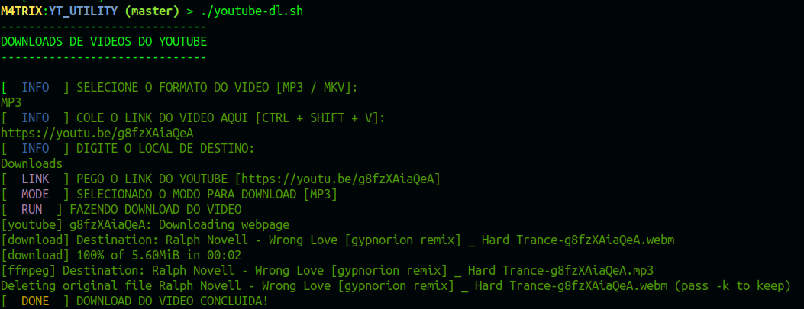

# PROGRAMA PARA BAIXAR VIDEOS DO YOUTUBE NO LINUX

 

## INSTALANDO O PROGRAMA YOUTUBE-DL
1. Acesse o Terminal: <kbd>Ctrl</kbd> + <kbd>Alt</kbd> + <kbd>T</kbd>
2. Ative o Arquivo **Install_youtubedl.sh**: `chmod +x Install_youtubedl.sh`
3. Rode o Arquivo para começar a instalação: `./Install_youtubedl.sh`
4. Quando ele for instalar irá pedir sua senha de Root para começar a instalação

---

## UTILIZANDO O PROGRAMA
1. Acesse o Terminal: <kbd>Ctrl</kbd> + <kbd>Alt</kbd> + <kbd>T</kbd>
2. Ative o Arquivo **youtube-dl.sh**: `chmod +x youtube-dl.sh`
3. Rode o Arquivo para começar o Download: `./youtube-dl.sh`
4. Ele vai pedir primeiro se deseja o arquivo em MP3 ou MKV
   1. Coloque exatamente **MP3** ou **MKV**
5. Depois vai pedir o Link do Video, só postar o Link que foi copiado do youtube
6. Depois coloque o nome do Diretório que deseja enviar o Arquivo, tem que ser exatamente o nome
7. O programa vai baixar o video, configurar para a extensão e salvar no Diretório escolhido

